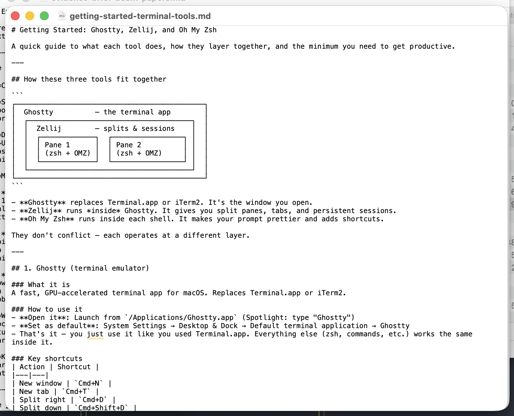
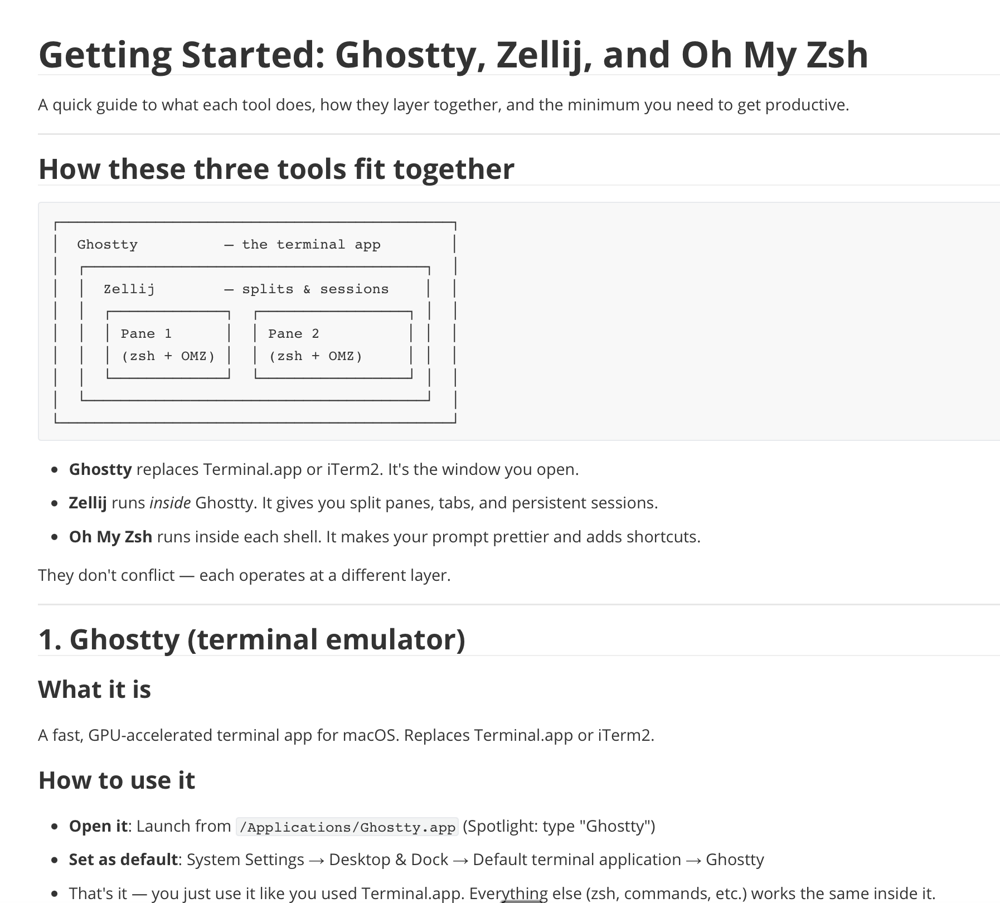

# Terminal + Claude Code

## What you're seeing

1. **A terminal app** — where you type commands
2. **Claude Code** — an AI assistant that runs in the terminal
3. Type a request → AI responds → iterate

Key ideas:

- AI can **read and write files** on your computer
- **Iterate**: "Make it shorter," "Add a section on X"
- Output is **Markdown** — readable as plain text or rendered nicely

## Quick Markdown overview

Markdown files are simple plain-text documents that use light formatting marks like `#` for headers and `-` for bullets.

- AI tools often write in **Markdown** by default
- It is a good **working output format** because it is lightweight and easy to edit
- Markdown can be converted into **Word files, PDFs, web pages, and slides**
- You do **not** need to know Markdown syntax for this bootcamp

The practical point is just: the AI may hand you a `.md` file, and that is normal.

## Raw Markdown vs rendered Markdown

:::: {.columns}
::: {.column width="50%"}
**Raw file**

{width="100%"}
:::
::: {.column width="50%"}
**Rendered preview**

{width="100%"}
:::
::::

- Left: the plain text with hashes and formatting marks
- Right: the same file shown in a Markdown viewer
- A viewer such as **Typora** makes Markdown look like normal formatted text

You do not need to learn the syntax today, but it helps to have an app that makes these files easy to read.

## Context and iteration

**Context window**: The AI only "sees" what you show it. Be explicit.

**Iteration tips:**

- First output is a draft, not a final product
- Refine: "Change the tone," "Add an example," "This is wrong because..."
- Save to a file so you can pick up later

**When it's wrong:** AI makes confident-sounding mistakes. Always review output, especially numbers and citations.

# Wrap-up

## Before next time (April 27)

- Try using an AI tool for **one real task** this week
- Think of a research or teaching task you'd like to automate
- Install guide: [eabeam.github.io/uvmecon-ai/prep.html](https://eabeam.github.io/uvmecon-ai/prep.html)

**Next session:** Research pipelines, web scraping, automated grading

## Resources

- Bootcamp site: [eabeam.github.io/uvmecon-ai](https://eabeam.github.io/uvmecon-ai)
- Claude Code docs: [docs.anthropic.com/en/docs/claude-code](https://docs.anthropic.com/en/docs/claude-code)
- UVM Copilot (free): [go.uvm.edu/copilot](https://go.uvm.edu/copilot)
