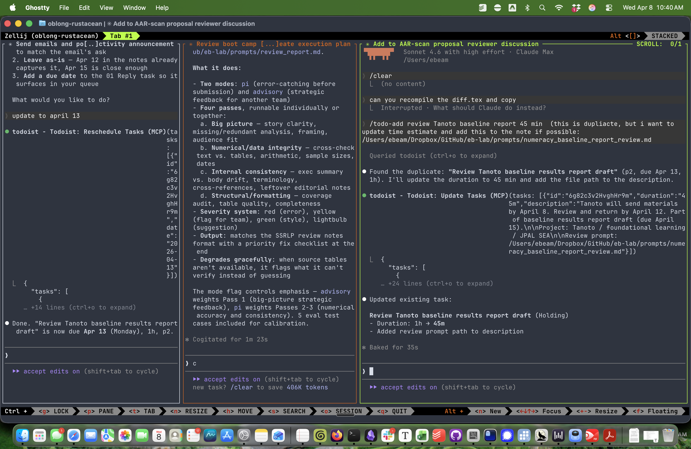
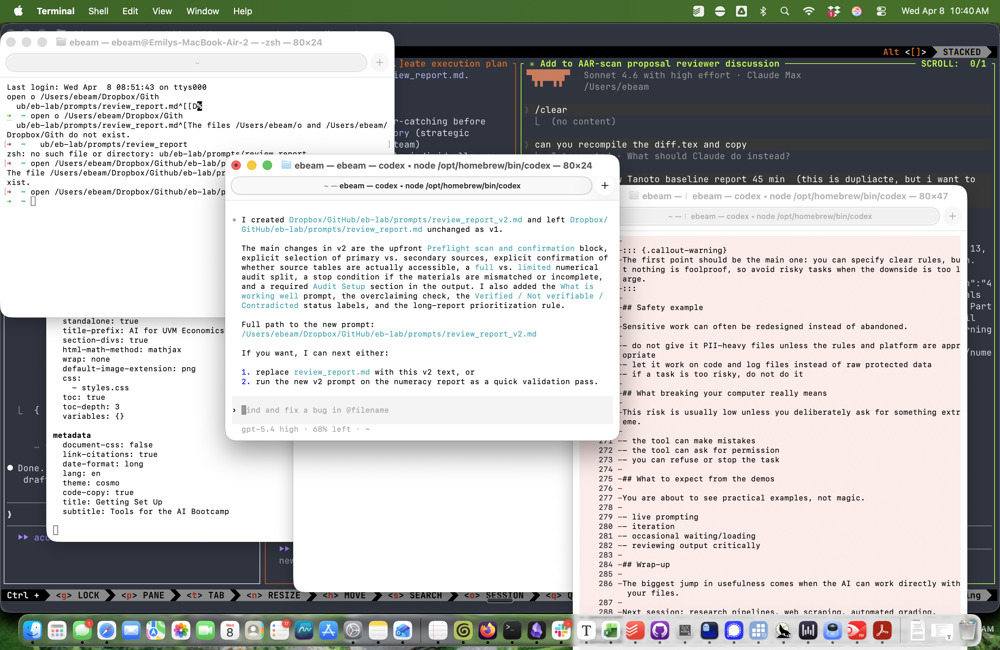
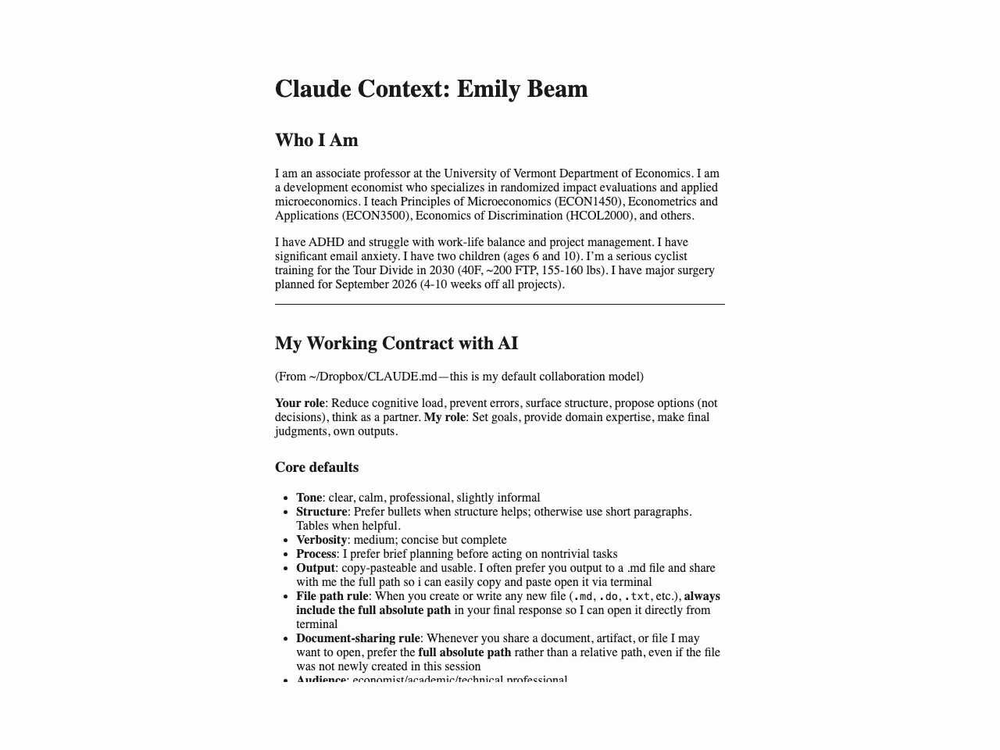
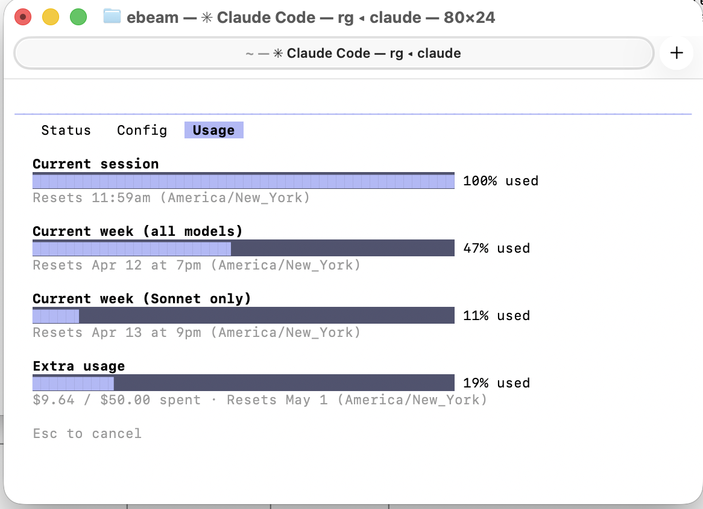
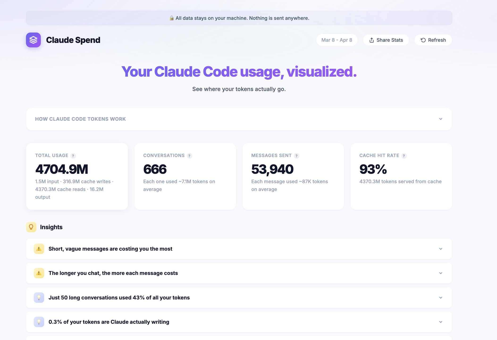

<style>
.reveal .slides .asidebox {
  margin-top: 1rem;
  padding: 0.75rem 1rem;
  border-left: 8px solid #2f6fab;
  background: #eaf2fb;
  border-radius: 8px;
  font-size: 0.9em;
}

.reveal .slides .tight-table table {
  width: 100%;
  font-size: 0.8em;
  line-height: 1.15;
}

.reveal .slides .tight-table col.term-col {
  width: 22%;
}

.reveal .slides .shot {
  border: 1px solid #d0d7de;
  border-radius: 10px;
  box-shadow: 0 4px 18px rgba(0, 0, 0, 0.08);
}
</style>

# Welcome

## What is this?

Two lunch sessions on AI tools for teaching and research.

- **Today**: getting started, what the tools do, live demos
- **April 27**: research workflows, web scraping, automated grading
- no installation required today
- watch now, ask questions, try things later

## We are still learning

This is a new space, for us and for the tools.

- we started using these tools in December and January while working on the Economics AI letter
- the learning curve is real, but it is short
- things are changing quickly
- some of what feels hard now may get much easier very soon

## The AI ladder

Where are you today?

| Level | Description |
|-------|-------------|
| 0 | Haven't tried it |
| 1 | Tried it once, wasn't impressed |
| 2 | Use occasionally for simple tasks |
| 3 | Regular user, integrated into workflow |
| 4 | Power user, multi-step workflows |
| 5 | Building systems with AI |

*Adapted from Kyle Jensen's AI adoption framework, as described in [Goldsmith-Pinkham (2026)](https://paulgp.substack.com/p/getting-started-with-claude-code).*

**Goal today:** show you what Levels 3-4 look like.

# How the tools differ

## Conversational AI vs Agentic AI

The useful distinction is not the brand name. It is what the tool can actually do for you and how directly it can work on your project.

| Conversational AI | Agentic AI |
|---|---|
| best for question-answering, drafting, summarizing, and quick help | best for multi-step work on real projects |
| usually one conversation at a time | can support multiple simultaneous workflows |
| you can upload files and sometimes do light coding tasks | can work across as many or as few files as you allow |
| tends to be session-by-session | can be shaped into more customized systems |
| easier to start with | more setup, but often more quality and efficiency |

In practice, we use both. We often run multiple Claude and Codex sessions at the same time with different tasks separated into different windows.

## Parallel workflows in practice

:::: {.columns}
::: {.column width="50%"}
{width="100%" .shot}
:::
::: {.column width="50%"}
{width="100%" .shot}
:::
::::

- separate tasks into separate sessions instead of piling everything into one thread
- one window might be planning, another writing, another code execution or review
- this is a normal part of agentic workflow, not an advanced edge case

## Vocabulary {.smaller}

A few shared terms will make the rest of the session easier to follow.

::: {.tight-table}
<table>
<colgroup>
  <col class="term-col" />
  <col />
</colgroup>
<thead>
  <tr><th>Term</th><th>What we mean</th></tr>
</thead>
<tbody>
  <tr><td><strong>Agent</strong></td><td>A tool instance carrying out a bounded task with some autonomy</td></tr>
  <tr><td><strong>Model</strong></td><td>The underlying AI system you are talking to</td></tr>
  <tr><td><strong>Session</strong></td><td>One conversation or one working thread with the tool</td></tr>
  <tr><td><strong>Context window</strong></td><td>The working memory available in the current session</td></tr>
  <tr><td><strong>Artifact</strong></td><td>A concrete output: file, draft, memo, script, table, or slide</td></tr>
  <tr><td><strong>Rule file</strong></td><td>A standing instructions file such as <code>CLAUDE.md</code> or <code>AGENTS.md</code></td></tr>
  <tr><td><strong>Project file</strong></td><td>A project-specific instructions file that lives with the project itself</td></tr>
  <tr><td><strong>Permissions</strong></td><td>The rules about what the tool may read, change, run, or send</td></tr>
  <tr><td><strong>Orchestration</strong></td><td>Coordinating several tasks, tools, or agents in one workflow</td></tr>
</tbody>
</table>
:::

## The tools landscape {.smaller}

:::: {.columns}
::: {.column width="48%"}
**Conversational AI**

- ChatGPT
- Claude.ai
- good for quick questions, drafting, summarizing, and uploaded files
- lower barrier to entry
:::
::: {.column width="52%"}
**Agentic AI**

- Claude Code
- Codex
- good for file access, iteration, reusable workflows, and longer jobs
- usually the better option when you want real outputs instead of just advice
:::
::::

::: {.asidebox}
UVM provides enterprise-level [Microsoft Copilot](https://go.uvm.edu/copilot) with higher data security and strong Microsoft Office integration, but it does not support the agentic workflows we are focusing on here.
:::

## Why file access matters

The jump from conversational AI to agentic AI is mostly about direct work on real files.

- less copy-paste
- easier iteration across many files
- persistent outputs that stay in your project
- easier to build workflows you can reuse later
- much better fit for real research, teaching, and website work

# Working with Projects

## About `CLAUDE.md` and `AGENTS.md`

For coding tools, these are standing instruction files that are loaded automatically when you start working in a project that contains them.

- they store stable preferences, permissions, workflow rules, and project context
- they reduce how much you need to re-explain every session
- you can have both general and project-specific versions
- they should stay short: if they get too long, they slow things down and important rules get lost

## Personal preferences example

:::: {.columns}
::: {.column width="58%"}
{width="100%" .shot}
:::
::: {.column width="42%"}
- good place for preferences like full file paths, permission rules, and writing defaults
- a file like [`EB-VOICE.md`](/Users/ebeam/Dropbox/GitHub/eb-lab/EB-VOICE.md) is one concrete example
- after a work session, you can update the file based on your edits
- keep it short enough that it stays useful
:::
::::

# Markdown

## Markdown (`.md`)

AI tools often write in Markdown because it is a simple plain-text format that converts easily into other outputs.

- common output for notes, reports, instructions, and drafts
- easy to convert into `docx`, `pdf`, `html`, slides, and other formats
- useful to get comfortable recognizing it, even if you do not write it yourself
- recommended viewers/editors:
  Typora ($15), MarkText, Zettlr, MacDown

## Raw Markdown vs rendered Markdown

Markdown looks ugly in raw form and normal in a viewer.

:::: {.columns}
::: {.column width="50%"}
**Raw Markdown**

{width="100%" .shot}
:::
::: {.column width="50%"}
**Rendered preview**

{width="100%" .shot}
:::
::::

# Working Memory

## Context window

The context window is the tool's working memory for the current session.

- every model has a maximum context window set by the model or the company
- as that working memory fills up, performance can get worse
- larger, messier sessions are more likely to accumulate mistakes
- this is one reason to separate tasks and work in multiple sessions
- depending on the tool, session-management commands may include things like `compact`, `/compact`, or `/clear`

## Session hygiene

For larger tasks, it helps to separate planning, execution, and review rather than doing everything in one long messy thread.

```{mermaid}
flowchart LR
    A[Prompt] --> B[Plan]
    B --> C[Execute]
    C --> D[Review]
    D --> E[Compact or clear]
    E --> F[Continue]
```

Useful code-like reminders:

- `plan`
- `compact`
- `/compact`
- `/clear`

## Checking Claude usage

:::: {.columns}
::: {.column width="54%"}
{width="100%" .shot}
:::
::: {.column width="46%"}
Two useful commands:

- `npx claude-spend`
- `npx ccusage@latest`

What this shows:

- session limits
- weekly limits
- extra paid usage
- current usage is not static and can change over time
:::
::::

## Usage changes over time

:::: {.columns}
::: {.column width="58%"}
{width="100%" .shot}
:::
::: {.column width="42%"}
- paid plans subsidize usage, so the effective pricing is often better than raw token prices
- pricing is still somewhat unclear and can shift
- some models are cheaper than others
- rates can be higher at busy times
- for Claude, peak time is often around `8 a.m.-1 p.m. EDT`, but that can change
:::
::::

# Safety

## Safety example

Sensitive work can often be redesigned instead of abandoned.

- do not give it PII-heavy files unless the rules and platform are appropriate
- let it work on code and log files instead of raw protected data
- if a task is too risky, do not do it
- paid subscriptions generally let you turn off training on your content, and that is recommended

## What breaking your computer really means

This risk is usually low unless you deliberately ask for something extreme.

- the tool can make mistakes
- the tool may pause and ask for permission on risky actions
- you can refuse, stop the task, or tighten the rules

# Collaboration

## GitHub and collaboration

These tools work especially well with GitHub-based workflows, though GitHub is not required.

- very useful for collaboration and version control
- especially powerful for intensive or shared coding projects
- makes it easier to track changes, compare versions, and work with others
- a power-up, not a prerequisite

## What to expect from the demos

You are about to see practical examples, not magic.

- live prompting
- iteration
- occasional waiting
- reviewing output critically

## Wrap-up

The biggest jump in usefulness comes when the AI can work directly with your files.

Next session: research pipelines, web scraping, automated grading.
